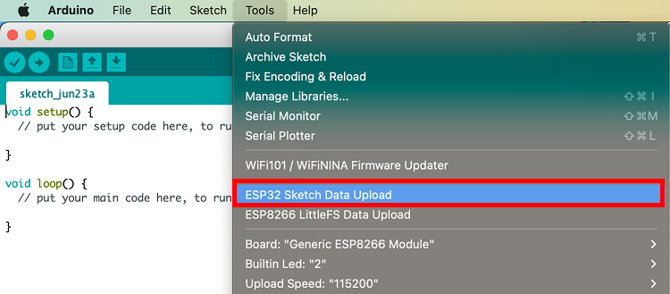
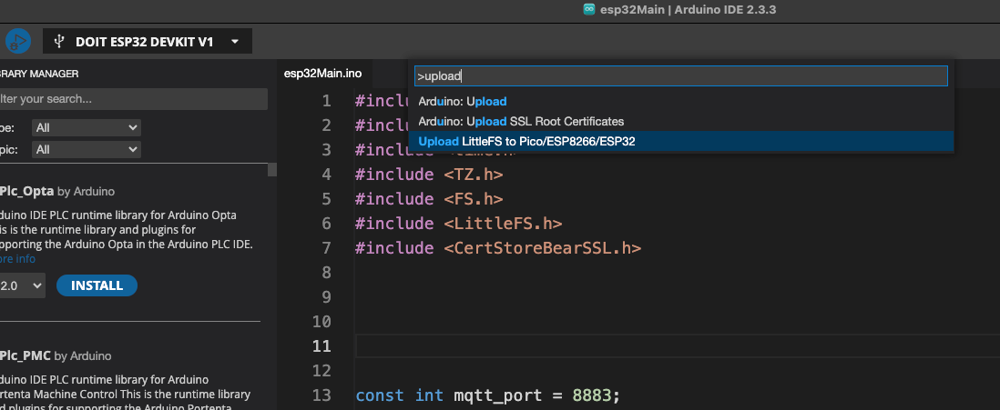

# vision_of_the_harmonics
Vision of The Harmonics


### webApp
- https://api.decade.tw/harmonics

### processingApp
```
/src/processingApp
```

### mcuApp
``` 
/src/mcuApp
```

### MQTT using wss(not simple ws)
``` 
/Applications/Arduino1819.app/Contents/Java/tools/ESP32FS/tool/esp32fs.jar
```



#### Use the command line tools directly (upload MQTT wss cert file to esp32) 

```angular2html
/Users/xlinx/Library/Arduino15/packages/esp32/tools/esptool_py/4.6/esptool --chip esp32 --port /dev/cu.usbserial-14210 --baud 921600 --before default_reset --after hard_reset write_flash -z --flash_mode dio --flash_freq 80m --flash_size detect 2686976 /var/folders/1d/gfl1y7h97xng7k_ylk1gz6g80000gn/T/tmp-28783-l6UDGuhIpRxA-.littlefs.bin
```
```angular2html
Uploading LittleFS filesystem
Command Line: /Users/xlinx/Library/Arduino15/packages/esp32/tools/esptool_py/4.6/esptool --chip esp32 --port /dev/cu.usbserial-0001 --baud 921600 --before default_reset --after hard_reset write_flash -z --flash_mode dio --flash_freq 80m --flash_size detect 2686976 /var/folders/1d/gfl1y7h97xng7k_ylk1gz6g80000gn/T/tmp-28783-TbI2SIXTUL3C-.littlefs.bin
esptool.py v4.6
Serial port /dev/cu.usbserial-0001
Connecting....
Chip is ESP32-D0WDQ6 (revision v1.0)
Features: WiFi, BT, Dual Core, 240MHz, VRef calibration in efuse, Coding Scheme None
Crystal is 40MHz
MAC: f0:08:d1:d5:14:74
Uploading stub...
Running stub...
Stub running...
Changing baud rate to 921600
Changed.
Configuring flash size...
Auto-detected Flash size: 4MB
Flash will be erased from 0x00290000 to 0x003effff...
Compressed 1441792 bytes to 139503...
Writing at 0x00290000... (11 %)
Writing at 0x00358cb8... (22 %)
Writing at 0x0035e3fa... (33 %)
Writing at 0x003648e5... (44 %)
Writing at 0x0036a895... (55 %)
Writing at 0x003704cb... (66 %)
Writing at 0x00375e82... (77 %)
Writing at 0x0037bbf7... (88 %)
Writing at 0x00381651... (100 %)
Wrote 1441792 bytes (139503 compressed) at 0x00290000 in 9.4 seconds (effective 1233.5 kbit/s)...
Hash of data verified.

Leaving...
Hard resetting via RTS pin...

Completed upload.
```
Under the hood, what the "ESP32 sketch data upload" Tool does is:

Generate a SPIFFS filesystem image from the contents of the data subfolder of your sketch.
Upload the filesystem to the ESP32 board.
It does these things using two command line tools:

mkspiffs - https://github.com/igrr/mkspiffs
esptool - https://github.com/espressif/esptool
So instead of using the "ESP32 sketch data upload" Tool from Arduino IDE, you can just work directly with those two tools from the command line terminal.

There is some information on that here:

https://docs.espressif.com/projects/esp-idf/en/latest/esp32/api-reference/storage/spiffs.html

####

mkspiffs
Another tool for creating SPIFFS partition images is mkspiffs. Similar to spiffsgen.py, it can be used to create an image from a given folder and then flash that image using esptool.py

For that, you need to obtain the following parameters:

Block Size: 4096 (standard for SPI Flash)

Page Size: 256 (standard for SPI Flash)

Image Size: Size of the partition in bytes (can be obtained from a partition table)

Partition Offset: Starting address of the partition (can be obtained from a partition table)

To pack a folder into a 1-Megabyte image, run:
```angular2html
Chip:  esp32
Start: 0x290000
Size : 0x160000
```


```
mkspiffs -c [src_folder] -b 4096 -p 256 -s 0x100000 spiffs.bin
```
To flash the image onto ESP32 at offset 0x110000, run:

```
python esptool.py --chip esp32 --port [port] --baud [baud] write_flash -z 0x110000 spiffs.bin
```

### littlefs for Arduino IDE v2.x

```angular2html
/Users/xlinx/.arduinoIDE/plugins
```
https://github.com/earlephilhower/arduino-littlefs-upload?tab=readme-ov-file

